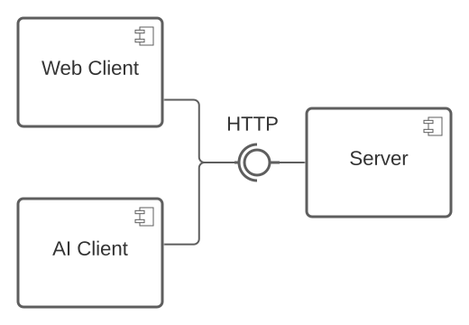

# Sokoban-Game

CS271 final project

# Usage

# Design

## Goal

* Implement a Sokoban game

* Build an AI to play this game as good as possible

## Components

### Server

Perform and handle the game logics.

### Web Client

Provide a user interface for human user to play. Interact with Server by HTTP.

### AI Client

Play the game by AI algorithms. Interact with Server by HTTP.

## Documents

* Core data structures: https://lucid.app/lucidchart/4bee14c8-1421-4302-83f7-469048e54a12/view?page=0_0#

# Working group

* Members:
    - Chang Yao Chung (Yao-Chung)
    - Josh Ho (JoshHo919)
    - Luis Hsu (LuisHsu)

* Meeting: Mon. Wed. Fri. 12:30 - 13:00